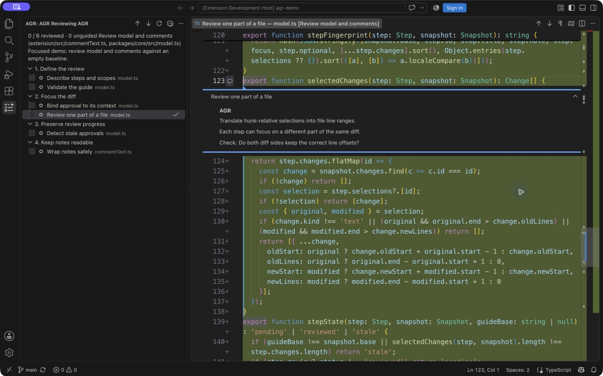

# AGR — Agent-Guided Reviews

**Review changes in the order that explains them.**

Agents can write a feature across dozens of files. An alphabetical file list makes you reconstruct the story yourself. AGR gives you an ordered walkthrough: small review steps, native VS Code diffs, short notes, and progress you can save.

Claude Code or Codex writes `.agr/<name>.json` in your repository using the included skill. The extension turns each file into a review you can select in the sidebar. One file can appear in several sections, with each step focusing on a different part of its diff.



*AGR reviewing its own review model. The same file appears in several steps, each focused on a different part of the diff.*

## Get started

Requires VS Code 1.95+, Git, Node.js 22+ for the skill helper, and Claude Code or Codex to generate a guide.

1. Install [AGR from the VS Code Marketplace](https://marketplace.visualstudio.com/items?itemName=dmitry-zaets.agr), or run `code --install-extension dmitry-zaets.agr`.
2. Open the Git repository you want to review in a trusted VS Code workspace.
3. Run **AGR: Install Agent Skills** from the Command Palette, then choose **Globally** or **This repository**.
4. Ask your agent:

   > Use the agr skill to create a guided review of my uncommitted changes. Explain the important decisions and split different concerns in the same file into separate steps.

5. Open **AGR** in the activity bar. Use **Switch Review** to choose a guide. Click a step to open its diff and notes, then mark it reviewed. Use the arrows to move between steps.

For repository installation, the command copies the skill to `.claude/skills/agr/` and `.agents/skills/agr/`. Start a fresh agent session if the skill is not discovered. Existing skill installations are not overwritten; see [updating skills](docs/usage.md#updating-skills).

## Upgrading from AGR 1.x

AGR 2.0 introduces nested version 2 guides and a progress bar. Update your agent skills as well as the extension. Resolvable version 1 guides migrate automatically, preserving valid approvals. Older extensions cannot read version 2 guides. See the [migration guide](docs/migrating-to-v2.md).

## Choose what to review

Ask the agent for the scope you need:

| Request | Comparison |
| --- | --- |
| “Review my uncommitted changes.” | HEAD → saved working files, including staged edits |
| “Review only what I staged.” | HEAD → Git index |
| “Review my unstaged edits.” | Git index → saved working files |
| “Create a guide for this PR: …” | PR merge-base → pinned PR tip |
| “Review my branch against main.” | Merge-base with main → branch tip |
| “Review these two commits.” | Chosen base → chosen head |
| “Review this branch and my local follow-up edits.” | Separate comparisons in one guide |

You can limit the scope to files or directories, or let the agent choose and explain the boundaries. For a PR, the agent retrieves metadata and fetches the required Git objects; AGR opens those versions without switching your working branch. Remote access uses your agent's existing tools and credentials.

## What you get

- Ordered sections and review questions beside native diffs.
- Separate steps for different parts of the same file, even within one hunk.
- Multiple named reviews in `.agr/`, with a sidebar picker and independent progress.
- Saved review progress; changed code or notes invalidate the affected approval.
- Visible **Unguided changes** for changes within the declared scope that the guide has not covered.
- A portable JSON guide and schema, with no AGR account or model API key.

AGR collects no telemetry. Reviews work locally by default. PR guides generated by the skill offer **Enable sync** or **Keep local** when opened. Optional sync (also available through **AGR: Connect GitHub PR**) marks fully reviewed files to GitHub’s Viewed checkboxes using your existing `gh` login. Guide generation runs through your chosen agent under its own settings. See [usage and troubleshooting](docs/usage.md) and [scope, coverage, and progress behavior](docs/review-model.md).

## Review files in 1.1

Store guides directly in `.agr/`, for example `.agr/checkout-flow.json` and `.agr/pr-142.json`. Use **AGR: Switch Review** to see their scopes, progress, and stale or unavailable status. The last selected review is remembered per repository.

Root `agr.json` is no longer read. To reuse a 1.0 guide, move it to `.agr/<name>.json` and update the agent skill. The guide’s JSON structure is unchanged.

Pinned commit reviews remain readable while their Git objects exist locally. Local reviews can become stale as files, the index, or HEAD change. Stale notes remain visible; regenerate the affected guide to review the current code. AGR does not archive old working-file contents.

## Skill installation location

**AGR: Install Agent Skills** asks whether to install **Globally** or in **This repository**. Global installation works without an open project and writes to `~/.agents/skills/agr/` for Codex and `~/.claude/skills/agr/` for Claude Code. If `CLAUDE_CONFIG_DIR` is set in VS Code’s environment, its directory replaces `~/.claude`. Repository installation writes both skill folders under the selected Git root. Canceling the prompt writes nothing.

Existing skills are not overwritten. Preserve customizations and move existing copies aside before reinstalling. Older repository skills may take precedence over a global installation, so update or remove those copies when switching to global skills. Review files always stay in each project’s `.agr/` folder. Start a fresh agent session after installing.

## Development

```sh
npm ci
npm run check
npm run test:extension
npm run package
code --install-extension extension/agr-1.1.0.vsix
```

For development, use Node.js 22.14+ within the 22.x line, or 24.10+. `.nvmrc` selects Node 22. `npm run package` rebuilds the extension and bundled skill before producing the VSIX. Integration tests open an isolated VS Code window with a disposable repository; Linux needs a display or `xvfb-run -a npm run test:extension`.

```text
extension/       VS Code extension, Marketplace README, icon, integration tests
skills/agr/      Portable Claude Code / Codex skill, schema, bundled helper
packages/core/   Git comparisons, guide model, CLI source, unit tests
scripts/         Build tooling
docs/            Usage, behavior, and publishing instructions
```

The standalone skill is available in [skills/agr](skills/agr). Its helper and schema are checked in so copying that folder works without installing this monorepo's dependencies. Edit the source in `packages/core/` and rebuild to update them.

CI checks pull requests and packages a VSIX. After checks pass on `main`, semantic-release uses Conventional Commits to publish versioned releases to GitHub and the Marketplace once credentials are configured.

See [CONTRIBUTING.md](CONTRIBUTING.md), [release preparation](docs/publishing.md), and the [changelog](extension/CHANGELOG.md).

## License

[MIT](LICENSE) © Dmitry Zaets.
